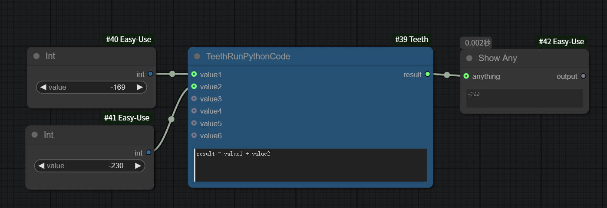
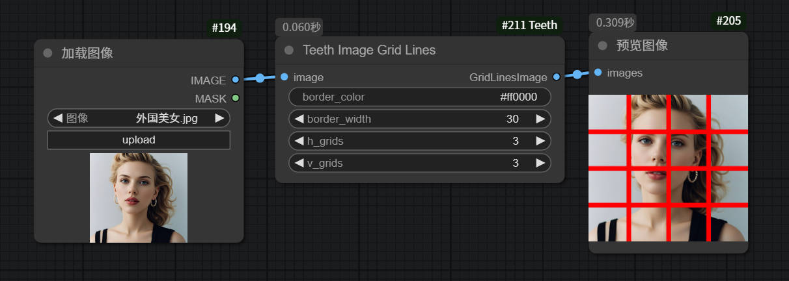

- 增加 `Teeth Run Python Code`, 运行python代码
- 增加 `Teeth Get Value By Index From List`, 获取List中的指定索引的元素
- 增加 `TeethTextSplitByDelimiter`, 分割字符串
- 增加 `Teeth Get First Seg`, 获取第一个seg
- 增加 `Teeth Find Contours`, 获取图片中的轮廓list
- 增加 `Teeth Split Grid Image`, 分割九(四)宫格图片  
- 增加 `Teeth Image Grid Lines`, 图片上面添加宫格线
- 增加 `Teeth Gemini2`, Gemini2 AI问答, 6个输入端口是可选的, 名字都是prompt, 支持文本和图片.
- 增加 `Teeth Load Text File`, 加载文本文件
- 增加 `Teeth Save Text File`, 保存文本文件


## Installation
1. Open a terminal or command line interface.
2. Navigate to the `ComfyUI/custom_nodes/` directory.
3. Run the following command: `git clone https://github.com/steelan9199/ComfyUI-Teeth.git`
4. Restart ComfyUI.
This command clones the repository into your `ComfyUI/custom_nodes/` directory. You should now be able to access and use the nodes from this repository.


## 安装依赖
一般不需要执行这个步骤, 因为这些依赖比较常用, 你电脑上的ComfyUI的其他插件, 应该已经装过这些依赖了
```
pip install -r requirements.txt
```


## workflow example:
获取轮廓  
  

运行python  
  

分割九(四)宫格图片  
  
  
图片上面添加宫格线  
  
  
Gemini2 AI问答  
Question: I sent you several images, which ones have animals? Which ones have people? Answer in Chinese.  
Answer: The first image has a person. The second image has a cat. The third image has people and an animal (it looks like a dog).  
  
  